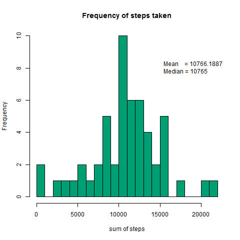
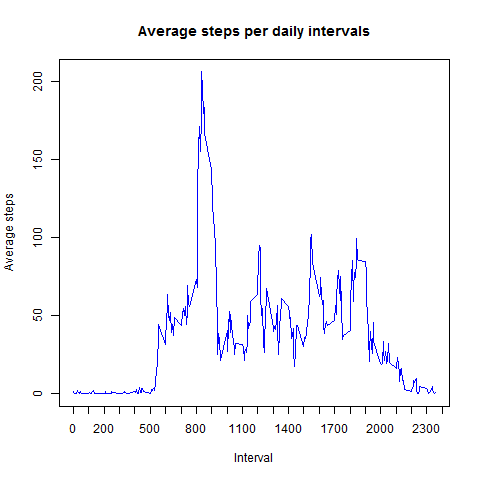
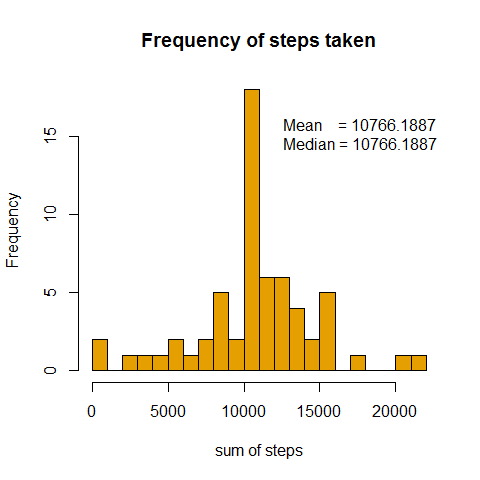
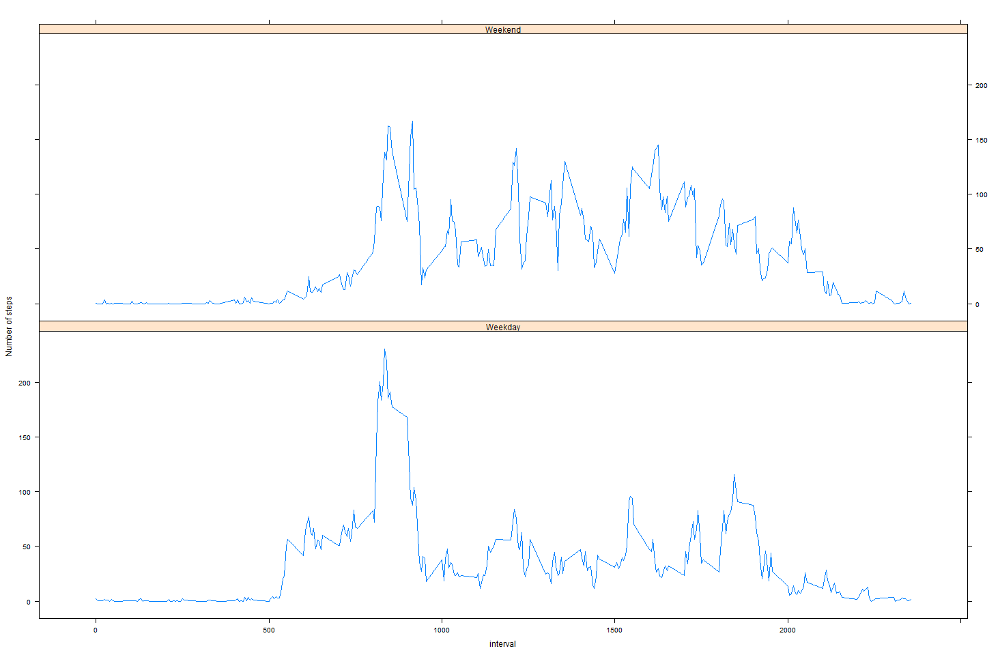

## Loading and preprocessing the data  


Assuming that the valid csv data exists and is located in the current working directory, we load up the data and convert the date column into a data object using the lattice library.


```{r}
library(lubridate)
# store the original data in the correct types
originalData <- read.csv(file = "activity.csv")
originalData$date <- ymd(originalData$date)
```


## What is mean total number of steps taken per day?


Given that several observations for the steps column  are NA, we need to skip these when we calculate number of steps taken per day.  The reasoning behind this is that NA values are not the same as 0 values.  When an NA value exists, it means that we don't have values for the observation and therefore should be skipped

```{r}
# Aggregate by date the total number of non-NA steps
nonNaData <- originalData[!is.na(originalData$steps),]
aggregatedData <- aggregate(nonNaData$steps,
                            by=list(date=nonNaData$date),
                            FUN=sum)
names(aggregatedData) <- c("date", "totalSteps")

```




## What is the average daily activity pattern?  
  
```{r}
aggregateByInterval <- aggregate(nonNaData$steps,
                                 by=list(interval=nonNaData$interval),
                                 FUN=mean)
names(aggregateByInterval) <- c("interval", "averageSteps")
```


With a simple calculation we can see that the maximum number of steps was at the 8:35 interval with an average of 206.1698
```{r}
aggregateByInterval[which.max(aggregateByInterval$averageSteps),]
```


## Imputing missing values
  
```{r}
totalMissingRows <- sum(is.na(originalData$steps))
```
  
There's a total of 2304 rows that have NA instead of the number of steps.  It wouldn't be good to simply substitute with zeros since this can skew calculations such as mean, however, we can fill in the values based on the average calculated for those rows that do have a value.  Given that we already calculated a table of averages per interval, the next step is to create a table of the rows with missing values, substitute these with the average, and join with those that had values from the beginning.

```{r}

library(dplyr)
naRows <- originalData[is.na(originalData$steps),]

joined <- left_join(naRows, aggregateByInterval, by = "interval")

# now recreate the original order of columns: steps, date, interval
naRowsModified <- select(joined, averageSteps, date, interval)
names(naRowsModified)[1] <- "steps"

# create a new data set where there are no NA values by binding both tables together
originalDataNoNa <- bind_rows(naRowsModified, nonNaData)

aggregateFilledInData <- aggregate(originalDataNoNa$steps,
                                   by=list(date=originalDataNoNa$date),
                                   FUN=sum)

names(aggregateFilledInData) <- c("date", "totalSteps")
```


If we compare this result against the one we got on the first exercise, in which we removed the NA values we can easily see that by replacing those missing values with the average per interval we are getting a higher density of median values.

## Are there differences in activity patterns between weekdays and weekends?

We need to create a new column called dayType that will be either "Weekend" or "Weekday" depending on the day of the week when the observation happened.
```{r}
dataSetWithWeekDays <- mutate(originalDataNoNa, 
                              dayType = as.factor( ifelse(weekdays(date) %in% c("Saturday", "Sunday"), 
                                                          "Weekend", 
                                                          "Weekday")))

aggregateWithWeekdays <- aggregate(steps~dayType+interval, 
                                   data=dataSetWithWeekDays, 
                                   FUN=mean)

names(aggregateWithWeekdays) <- c("dayType", "interval", "steps")
```
Create a plot with those values
```
xyplot(steps ~ interval | dayType, 
       data = aggregateWithWeekdays, 
       layout=c(1,2), 
       type = "l", 
       ylab = "Number of steps")
```


This last graph demonstrates that there are certainly different activity patterns between weekends and weekdays.  on average, theres' a lower number of steps observed during working hours but a spike around rush hour.